# react-spa-jwt-authentication-boilerplate

This project aims to give an opensource lean boilerplate for email based microservice authentication that can be used by both web applications as well as native applications.

Ideally, we suggest both the web apps and native apps to interact with the backend through APIs after the login. (The project aims especially SPAs.)

## Flows

Here we'll try to look at the infrastructure from different angles
- Roles
- Scenarios
	- The flows in frontend
	- The process flows
- React Component (Class) Flows

### Roles

* User
* Browser or Native Application (their interaction with backend should be exactly the same)
* Request Handler
* Database
* Mailer
* Lock Handler
* Validations

### Scenarios

#### Sign Up

##### Frontend Experience
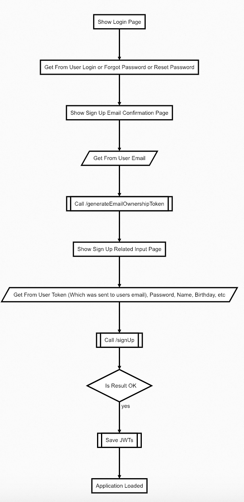
##### Process
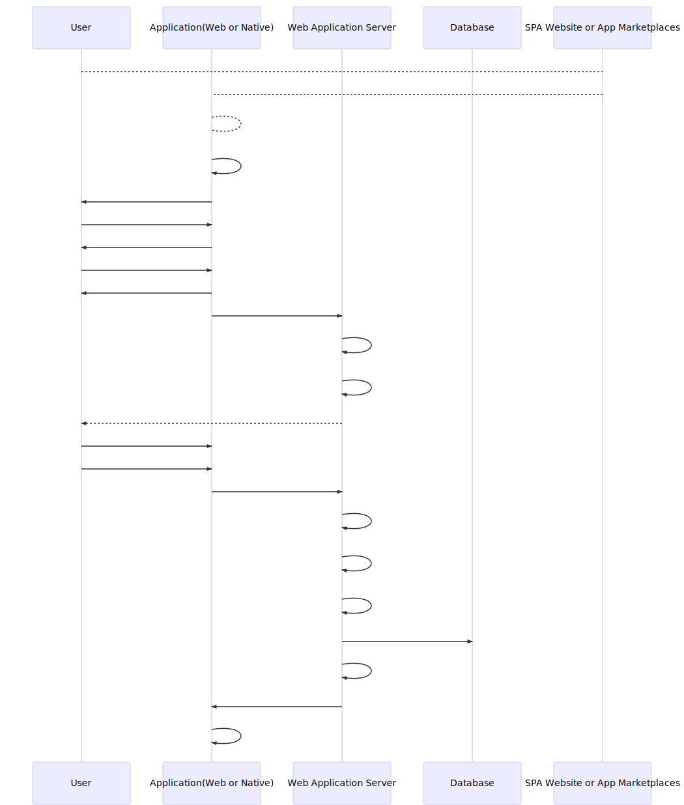

#### New Logins

##### Frontend Experience
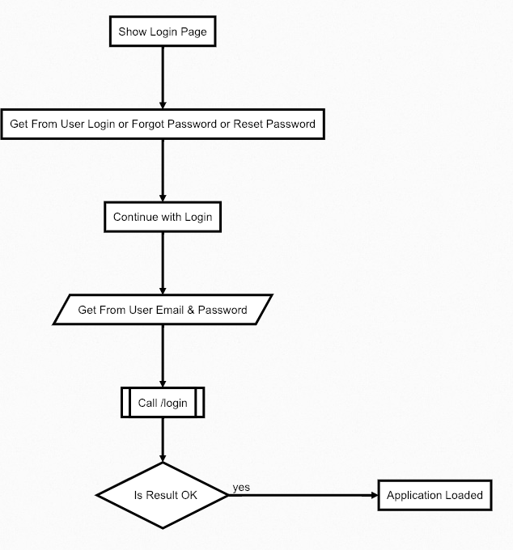
##### Process
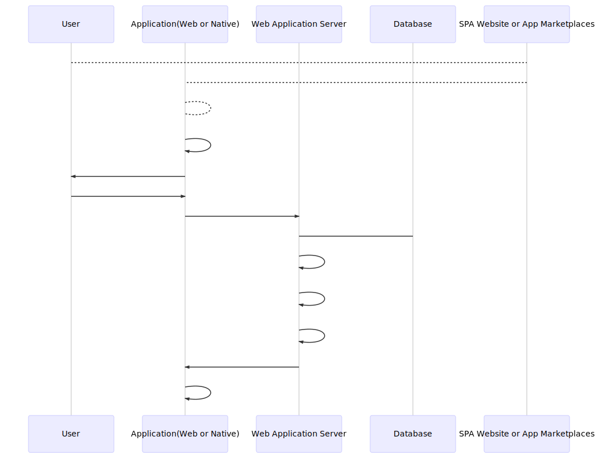

#### Remember Me Login

##### Frontend Experience
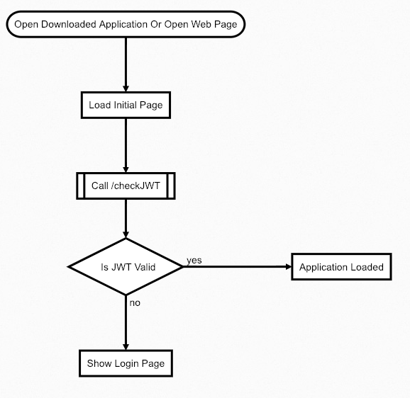
##### Process
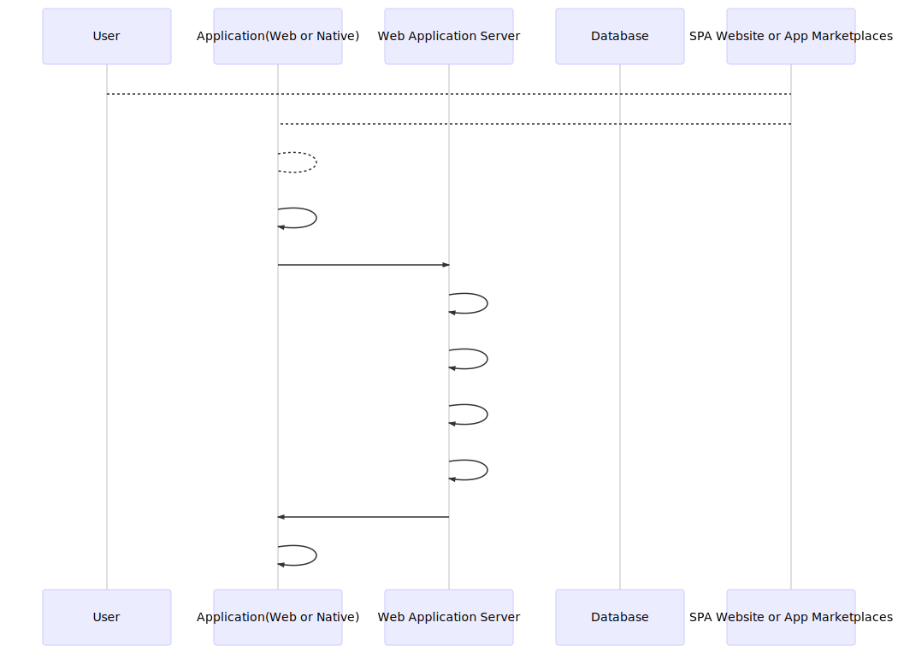

#### Forgot Password

##### Frontend Experience
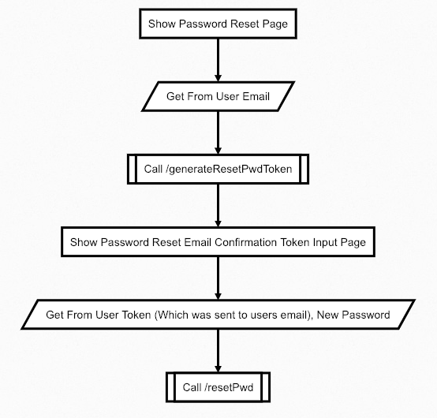
##### Process
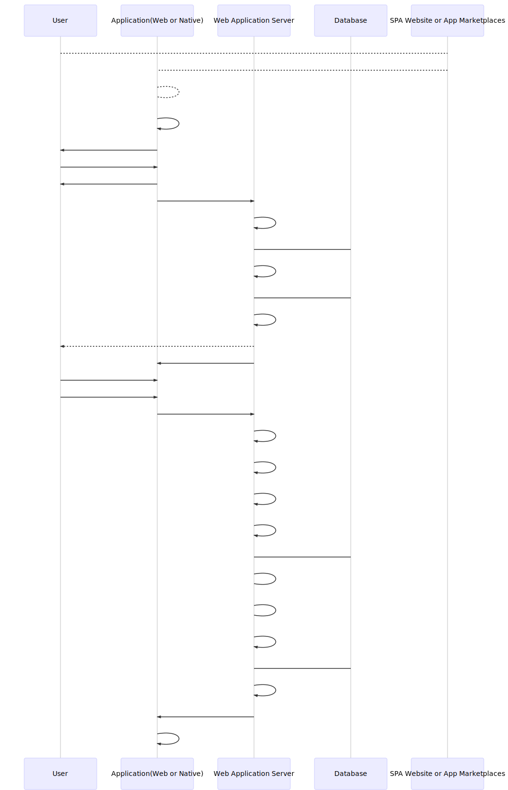

#### Change Password

##### Frontend Experience
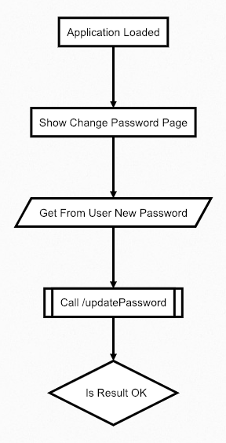
##### Process
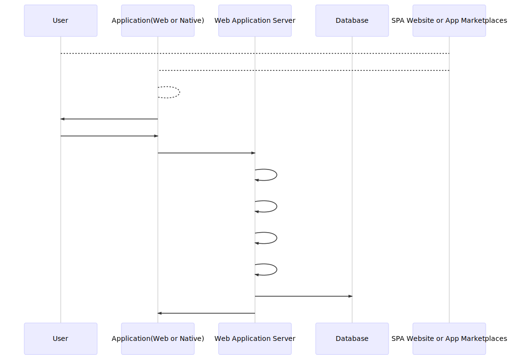

#### Change Email

##### Frontend Experience
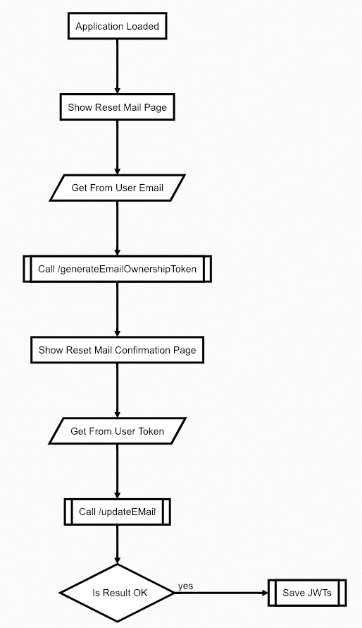
##### Process
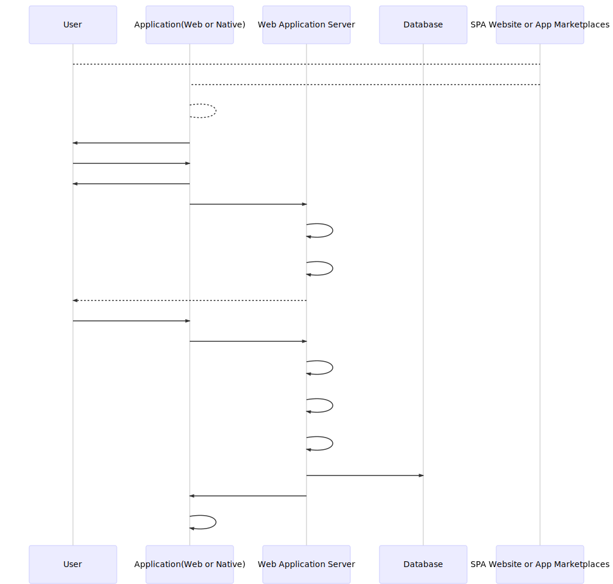

#### Update User Data

##### Frontend Experience
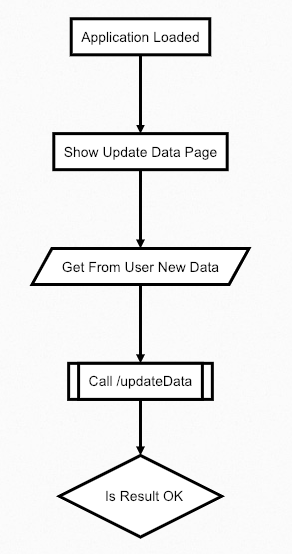
##### Process
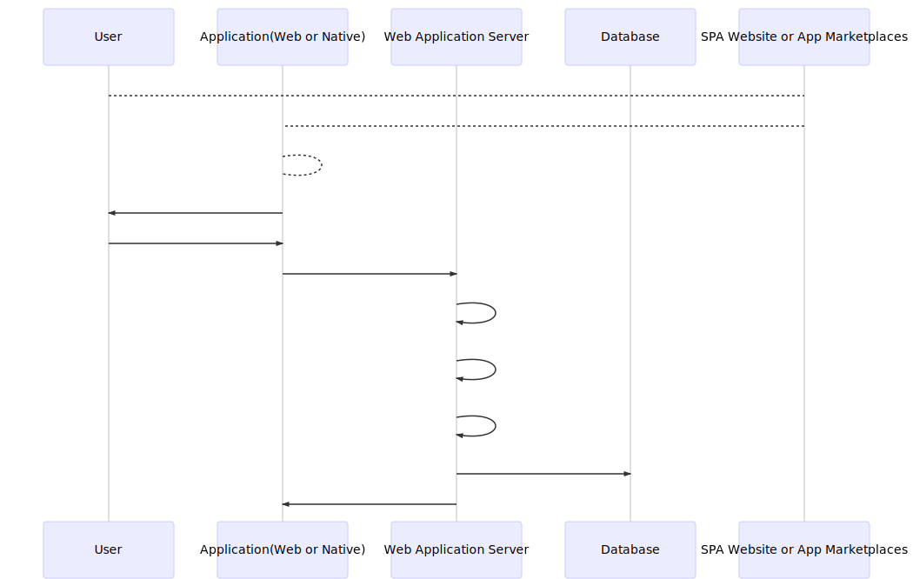


**Please be informed that this project is under development, not yet finalized and open to any contribution from opensource community.**

## React Component (Class) Flows

The native and web frontend components are very similar. The reasons that they are not unified are: 

1. There are no consistent UI libraries that work similar for native and web. We use native-base in native and material ui in web frontend. They are the most used frameworks for their areas.
2. Native application is generated by Expo and web application is generated by create-react-app. The two tools have slight differences in their navigation approaches.

We tried to unify these navigations as much as possible.

Below is the comparison of component flows in native and web application. As you see the difference is minimal.

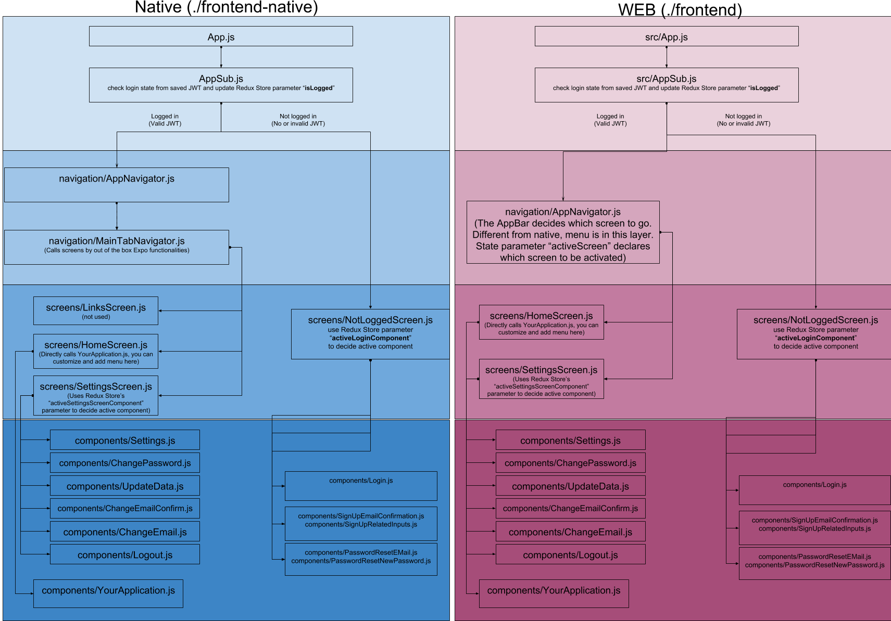

## Principles

Following should apply for the whole structure:

* Lean
* Authentication is done with JWT - Jason Web Tokens
* Stateless, API driven
* Microsevices
* Scalable
* Opensource
* SQL's should define the "model"
* Because of its microservices and API driven nature "view" are delegeted to SPA or native applications (they also exist in frontend and frontend-native folders)
* It must be easily cloned and when executed it should run (*) 

(*) This project uses [MySQL](https://www.mysql.com/). Because of the [license model of MySQL] (https://www.mysql.com/about/legal/licensing/oem/), if you use this boilerplate, do not distribute MySQL binaries.

## Prerequisites

* Ubuntu is prefered
* MySQL is chosen for user database

## Frontend

* Source code in ```./frontend``` directory
* Web App is generated by [create-react-app](https://github.com/facebook/create-react-app) to have all wiring ready with babel and webpack
* SPA - Single Page Application approach is used
* Redux is used to track login state
* The common library [Material UI](https://material-ui.com/) which implements [Google's material design principles](https://material.io), is used for Material Design UI components

## Frontend Native

* Source code in ```./frontend-native``` directory
* Native App is generated by [Expo](https://expo.io/) to have all wiring ready and a test suite that does not require XCode, hence Mac ownership
* Redux is used to track login state
* The common library [NativeBase](https://nativebase.io/) is used for both iOS and Android UI components

## Backend

* Source code in ```./backend``` directory
* Based on [Express](https://expressjs.com/)
* All authentication is with [JWT](https://jwt.io/) (the node library [jsonwebtoken](https://github.com/auth0/node-jsonwebtoken) is used)
* Passwords are hashed by [bcrypt](https://www.npmjs.com/package/bcrypt)
* Uses [MySQL] (https://www.mysql.com/) as the user repository database (*)
* For email uses [nodemailer](https://nodemailer.com/about/)

(*) It is completely OK if you swap the MySQL with other databases. The database scripts are in pure SQL so it should, in theory, be fine to use with other relateional database servers.

## Setup

0. Please note if you are not using MySQL, you'll need to modify database connections in the code. That is why we suggest you to setup MySQL. For a clean guide to set up MySQL for Ubuntu yo can refer [here](https://www.digitalocean.com/community/tutorials/how-to-install-mysql-on-ubuntu-18-04).

1. Set environment parameters for mail and relational database. If you choose to use MySQL and linux adding following lines to `~/.bashrc` file should be sufficient. (Please update username, password, etc correctly.)

```bash
############# react-spa-jwt-authentication-boilerplate #############
# JWT Secret
export JWT_SECRET="your-secret-do-not-forget-to-change"
# Mail Transporter Parameters 
export GENERIC_MAIL_SERVICE="yourmailtransporter" #Example: "gmail"
export GENERIC_MAIL_USER="yourusername" #Example: "name.surname@gmail.com"
export GENERIC_MAIL_PASSWORD="yourpassword" #Example: "Password1:-)"
# MySQL Parameters 
export MYSQL_HOST="yourhost"  #Example "localhost"
export MYSQL_USER="yourdbuser"  #Example "root"
export MYSQL_PASSWORD="yourdbpassword"  #Example "tiger"
############# react-spa-jwt-authentication-boilerplate #############
```

Please note, if you are planning to use your gmail account as your mailer, you need to make the "Less secure app access" on from your gmail settings:

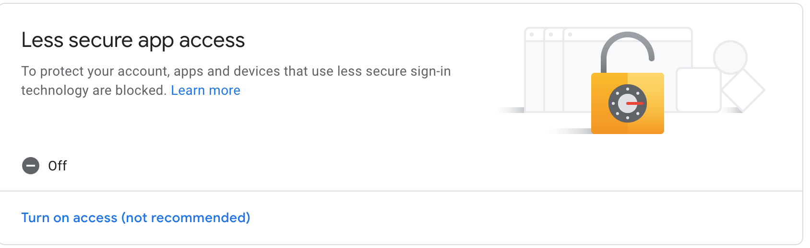


2. Download codes

```bash
git clone https://github.com/MehmetKaplan/react-spa-jwt-authentication-boilerplate my-authentication-app
```

3. Go to database script folder

```bash
cd my-authentication-app/backend/database
```

Skip below 2 steps, if you have another relational database system. But assure to generate a schema named AuthUsersDB and under that schema generate the objects stated in Generate_Objects.sql file.

4. Generate the schema. (You'll need to provide root password).

```bash
mysql -u root -p < Generate_Database.sql 
```

5. Generate the objects. (You'll need to provide root password).

```bash
mysql -u root -p < Generate_Objects.sql 
```

6. Install modules for backend. (There may be warnings but assure there are no errors.)
```bash
cd [YOUR-ROOT-DIRECTORY]/backend
yarn install
mkdir dist
```

7. Install modules for native appliation. (There may be warnings but assure there are no errors.)
```bash
cd [YOUR-ROOT-DIRECTORY]/frontend-native
yarn install
```

8. Install modules for web appliation. (There may be warnings but assure there are no errors.)
```bash
cd [YOUR-ROOT-DIRECTORY]/frontend
yarn install
```

9. Update the following configuration parameter both in ```./frontend/src/common-logic/config.js``` and ```./frontend-native/common-logic/config.js```. Please be aware that for expo application, since it runs in your phone, the most appropriate way would be to connect your computer to internet thorugh your phone via cable so that you have a stable connection. And use the IP of your computer instead of ```localhost``` in below configuration. 

```javascript
mainServerBaseURL: "http" + "://" + "localhost" + ":" + "8000",
```

# Run In Your Local Ubuntu

## Frontend (for web)

In seperate 2 terminals run following.

### Backend 

From root of project:

```bash
cd ./backend
yarn start
```

### Frontend

From root of project:

```bash
cd ./frontend
yarn start
```

## Frontend Native

In seperate 2 terminals run following sequentially (since start up sucks too much CPU power).

### Backend 

From root of project:

```bash
cd ./backend
yarn start
```

### Frontend Native

From root of project:

```bash
cd ./frontend-native
yarn start
```

Now you should see a QR code within the termical (cool! :-) ) which you may scan with your phone. And your phone will suggest you to open with "expo application". If that application is not loaded you should first install it.

When opening the native application through expo client, it takes a few minutes, be patient and reload a few times until you see javascript bundling info in the terminal. Something like:

```
Building JavaScript bundle [===     ] XX%
```

# Guidelines To Use for Your Own Project

After you cloned the whole structure with following principles you can use the entire repo as your base and build your own single page web and react native applications on top of it.

## Frontend Native

* ```frontend-native/common-logic``` keeps the shared logic with web application. It must be same as ```frontend/common-logic```. :-) 
	* Components are not placed in any common area since components should deal only with presenting the data and it should be web / native specific.
	* On the other hand logic of how the data is retrieved, manipulated and posted should be exactly the same for both web and native applications.
* Start with command ```yarn start``` which runs Expo application. Rest is same as you are working in an [Expo](https://expo.io/) application.
* The layout of pages are components and you can find them under the ```frontend-native/components``` folder. Modifying them you can change the view of your project however you like.
* The redux store is in the ```frontend-native/common-logic/redux-store.js``` file. You can update this file and use it similarly in your project.

## Frontend

* ```frontend/common-logic``` keeps the shared logic with web application. It must be same as ```frontend-native/common-logic```. :-)
* Start with command ```yarn start``` which runs a ReactJS application which is generated by [create-react-app](https://github.com/facebook/create-react-app) tool.
* The layout of pages are components and you can find them under the ```frontend/components``` folder. Modifying them you can change the view of your project however you like.
* The redux store is in the ```frontend/common-logic/redux-store.js``` file. You can update this file and use it similarly in your project.


## Backend

* Start with command ```yarn start``` which runs Express application framework. Rest is same as you are working in an [Express](https://expressjs.com/) web application.
	* Middleware (the JS code that connects requests with responses) are not placed in a directory structure since the logic is pretty straight forward.
* All behaviour configurations should be placed under ```backend/config.js``` file.
* Database selects are in ```backend/sqls.js``` so that from a single point the persistent layer interaction can be analysed. 
* The email communication with users is governed by ```backend/mailer.js```.
* The fraudelent requests are to be detected by ```backend/lock_handler.js```.
* ```backend/database_action_mysql.js``` governs communication with MySQL database with 2 simple wrapper functions. By default they are left as logging the sql statements that they are executing.
* ```backend/generic_library.js``` keeps a few helper javascript function.
* ```backend/server.js```, as a standard Express application, keeps track of routes, all of which are API requests, except the web application (the ```frontend``` application)
* ```backend/validations.js``` is resposible of the request parameters' validations.

## Licenses

The license is MIT and full text [here](LICENSE).

### Backend used modules

* express license [here](./OtherLicenses/express.txt)
* jsonwebtoken license [here](./OtherLicenses/jsonwebtoken.txt)
* bcrypt license [here](./OtherLicenses/bcrypt.txt)
* mysql license [here](./OtherLicenses/mysql.txt)
* nodemailer license [here](./OtherLicenses/nodemailer.txt)
* babel license [here](./OtherLicenses/babel.txt)
* cors license [here](./OtherLicenses/cors.txt)
* date-and-time license [here](./OtherLicenses/date-and-time.txt)
* rimraf license [here](./OtherLicenses/rimraf.txt)

### Frontend used modules

* react license [here](./OtherLicenses/react.txt)
* material-ui license [here](./OtherLicenses/material-ui.txt)
* react-scripts license [here](./OtherLicenses/react-scripts.txt)
* redux license [here](./OtherLicenses/redux.txt)
* moment license [here](./OtherLicenses/moment.txt)

### Frontend Native used modules

* react license [here](./OtherLicenses/react.txt)
* react-native license [here](./OtherLicenses/react-native.txt)
* expo license [here](./OtherLicenses/expo.txt)
* react-navigation license [here](./OtherLicenses/react-navigation.txt)
* react-redux license [here](./OtherLicenses/react-redux.txt)
* redux license [here](./OtherLicenses/redux.txt)
* babel license [here](./OtherLicenses/babel.txt)
* moment license [here](./OtherLicenses/moment.txt)
