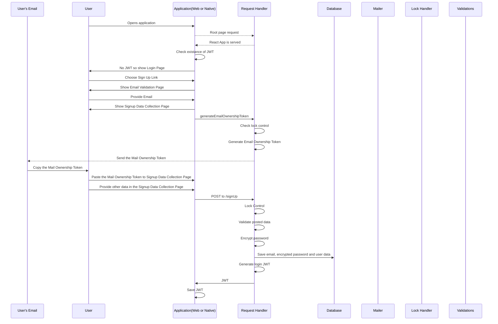

# react-spa-jwt-authentication-boilerplate

This project aims to give an opensource lean boilerplate for email based microservice authentication that can be used by both web applications as well as native applications.

Ideally, we suggest both the web apps and native apps to interact with the backend through APIs after the login. (The project aims especially SPAs.)

### Roles

* User
* Browser or Native Application (their interaction with backend should be exactly the same)
* Request Handler
* Database
* Mailer
* Lock Handler
* Validations

### Scenarios

#### Sign Up

#### New Login
#### Remember Me Login
#### Forgot Password
#### Change Password
#### Change Email
#### Update User Data

**Please be informed that this project is under development, not yet finalized and open to any contribution from opensource community.**

## Principles

Following should apply for the whole structure:

* Lean
* Authentication is done with JWT - Jason Web Tokens
* Stateless, API driven
* Microsevices
* Scalable
* Opensource
* SQL's should define the "model" of MVC
* Because of its microservices and API driven nature "view"s of MVC are delegeted to SPA or native applications (they also exist in frontend and frontend-native folders)
* It must be easily cloned and when executed it should run (*) 

(*) This project uses [MySQL](https://www.mysql.com/). Because of the [license model of MySQL] (https://www.mysql.com/about/legal/licensing/oem/), if you use this boilerplate, do not distribute MySQL binaries.

## Prerequisites

* Ubuntu is preferede
* MySQL is chosen for user database

## Frontent

* UI is pure [React](https://reactjs.org/) based
* App is generated by [create-react-app](https://github.com/facebook/create-react-app) to have all wiring ready with babel and webpack
* SPA - Single Page Application approach is used
* The common React library [Material UI](https://material-ui.com/) which implements [Google's material design principles](https://material.io), is used for Material Design UI components

## Backend

* Based on [Express](https://expressjs.com/)
* All authentication is with [JWT](https://jwt.io/) (the node library [jsonwebtoken](https://github.com/auth0/node-jsonwebtoken) is used)
* Passwords are hashed by [bcrypt](https://www.npmjs.com/package/bcrypt)
* Uses [MySQL] (https://www.mysql.com/) as the user repository database (*)
* For email uses [nodemailer](https://nodemailer.com/about/)

(*) It is completely OK if you swap the MySQL with other databases. The database scripts are in pure SQL so it should, in theory, be fine to use with other relateional database servers.

## Setup

0. Please note if you are not using MySQL, you'll need to modify database connections in the code. That is why we suggest you to setup MySQL. For a clean guide to set up MySQL for Ubuntu yo can refer [here](https://www.digitalocean.com/community/tutorials/how-to-install-mysql-on-ubuntu-18-04).

1. Set environment parameters for mail and relational database. If you choose to use MySQL and linux adding following lines to `~/.bashrc` file should be sufficient. (Please update username, password, etc correctly.)

`
############# react-spa-jwt-authentication-boilerplate #############
# JWT Secret
export JWT_SECRET="your-secret-do-not-forget-to-change"
# Mail Transporter Parameters 
export GENERIC_MAIL_SERVICE="yourmailtransporter" #Example: "gmail"
export GENERIC_MAIL_USER="yourusername" #Example: "name.surname@gmail.com"
export GENERIC_MAIL_PASSWORD="yourpassword #Example: "Password1:-)"
# MySQL Parameters 
export MYSQL_HOST="yourhost"  #Example "localhost"
export MYSQL_USER="yourdbuser"  #Example "root"
export MYSQL_PASSWORD="yourdbpassword"  #Example "tiger"
############# react-spa-jwt-authentication-boilerplate #############
`

2. Download codes

`
git clone https://github.com/MehmetKaplan/react-spa-jwt-authentication-boilerplate my-authentication-app
`

3. Go to database script folder

`
cd my-authentication-app/backend/database
`

Skip below 2 steps, if you have another relational database system. But assure to generate a schema named AuthUsersDB and under that schema generate the objects stated in Generate_Objects.sql file.

4. Generate the schema. (You'll need to provide root password).

`
mysql -u root -p < Generate_Database.sql 
`

5. Generate the objects. (You'll need to provide root password).

`
mysql -u root -p < Generate_Objects.sql 
`

# TO BE CONTINUED

* Sequence diagrams
* Frontend (not yet detailed)